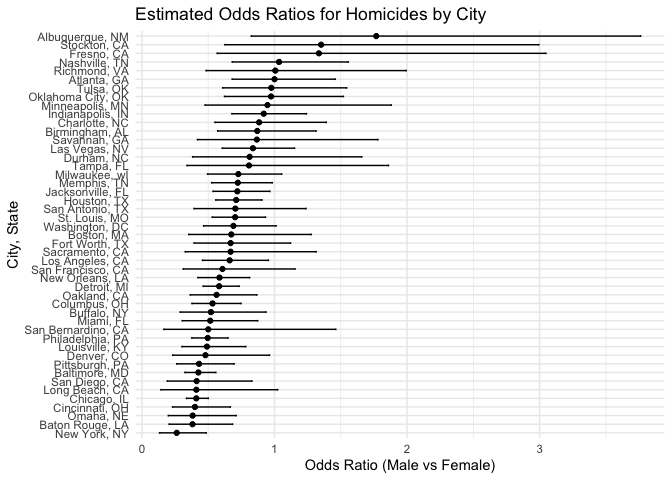
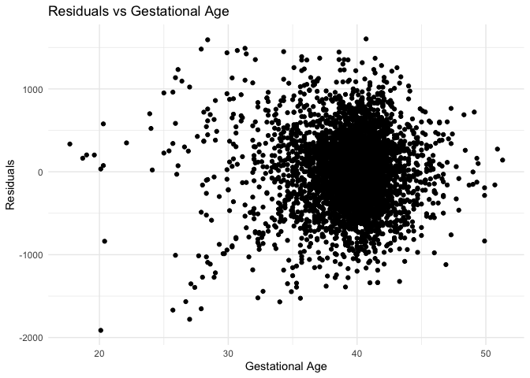
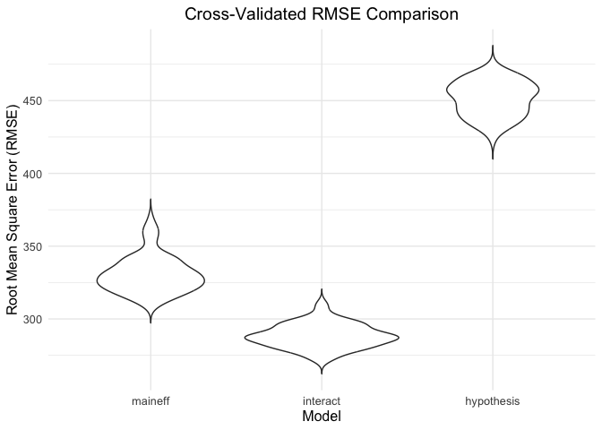

p8105_hw6_ts3670
================
Tong Su
2024-12-03

## Problem 2

``` r
homicide_df <- read_csv("https://raw.githubusercontent.com/washingtonpost/data-homicides/master/homicide-data.csv") 
```

    ## Rows: 52179 Columns: 12
    ## ── Column specification ────────────────────────────────────────────────────────
    ## Delimiter: ","
    ## chr (9): uid, victim_last, victim_first, victim_race, victim_age, victim_sex...
    ## dbl (3): reported_date, lat, lon
    ## 
    ## ℹ Use `spec()` to retrieve the full column specification for this data.
    ## ℹ Specify the column types or set `show_col_types = FALSE` to quiet this message.

``` r
homicide_df = homicide_df |>
  mutate(city_state = paste(city, state, sep = ", "),
         status = if_else(disposition == "Closed by arrest", 1, 0)
           ) |>  
  filter(
    !city_state %in% c("Dallas, TX", "Phoenix, AZ", "Kansas City, MO", "Tulsa, AL"),
    victim_race %in% c("White", "Black"),
    victim_age != "Unknown") |>
  mutate(victim_age = as.numeric(victim_age)) |>
  select(-city, - state, -disposition)
```

By cleaning the data, the `homicide_df` includes 39403 rows and 11
columns.

    ## 
    ## 
    ## |term           | estimate| std.error| statistic| p.value| conf.low| conf.high|
    ## |:--------------|--------:|---------:|---------:|-------:|--------:|---------:|
    ## |victim_sexMale |   0.4255|    0.1382|   -6.1839|       0|   0.3242|    0.5576|

Selecting `Baltimore, MD`’s data and fit into binary logistic regression
model with `glm` and use variables `victim_age`, `victim_race`,
`victim_sex` to make prediction on `solved_case`.

``` r
city_result = homicide_df |>
  group_by(city_state) |>
  nest() |>
  mutate(
    glm_model = map(
      data, ~ glm(status ~ victim_age + victim_sex + victim_race, data = ., family = "binomial")),
    glm_tidy = map(glm_model, ~ broom::tidy(., conf.int = TRUE))) |>
  select(city_state, glm_tidy) |>
  unnest(cols = glm_tidy)
```

    ## Warning: There were 44 warnings in `mutate()`.
    ## The first warning was:
    ## ℹ In argument: `glm_tidy = map(glm_model, ~broom::tidy(., conf.int = TRUE))`.
    ## ℹ In group 1: `city_state = "Albuquerque, NM"`.
    ## Caused by warning:
    ## ! glm.fit: fitted probabilities numerically 0 or 1 occurred
    ## ℹ Run `dplyr::last_dplyr_warnings()` to see the 43 remaining warnings.

``` r
odds_ratios <- city_result |>
  filter(term == "victim_sexMale") |>
  mutate(OR = exp(estimate),
         lower_CI = exp(conf.low),
         upper_CI = exp(conf.high)) |>
  select(city_state, OR, lower_CI, upper_CI)

print(odds_ratios)
```

    ## # A tibble: 47 × 4
    ## # Groups:   city_state [47]
    ##    city_state         OR lower_CI upper_CI
    ##    <chr>           <dbl>    <dbl>    <dbl>
    ##  1 Albuquerque, NM 1.77     0.825    3.76 
    ##  2 Atlanta, GA     1.00     0.680    1.46 
    ##  3 Baltimore, MD   0.426    0.324    0.558
    ##  4 Baton Rouge, LA 0.381    0.204    0.684
    ##  5 Birmingham, AL  0.870    0.571    1.31 
    ##  6 Boston, MA      0.674    0.353    1.28 
    ##  7 Buffalo, NY     0.521    0.288    0.936
    ##  8 Charlotte, NC   0.884    0.551    1.39 
    ##  9 Chicago, IL     0.410    0.336    0.501
    ## 10 Cincinnati, OH  0.400    0.231    0.667
    ## # ℹ 37 more rows

``` r
ggplot(odds_ratios, aes(x = reorder(city_state, OR), y = OR)) +
  geom_point() +
  geom_errorbar(aes(ymin = lower_CI, ymax = upper_CI), width = 0.2) +
  coord_flip() +
  labs(
    title = "Estimated Odds Ratios for Homicides by City",
    x = "City, State",
    y = "Odds Ratio (Male vs Female)"
  ) +
  theme_minimal()
```

<!-- -->

In the adjusted odds ratio plot, we observe that homicides involving
male victims are less likely to be solved compared to those involving
female victims in most cities. However, caution is needed for cities
where the confidence intervals include 1, as this typically indicates
that the result is not statistically significant at the 95% confidence
level.

## Problem 3

``` r
bw_df = read_csv("https://p8105.com/data/birthweight.csv") |>
  mutate(
      babysex = 
        recode_factor(babysex, 
                      `1` = "Male", 
                      `2` = "Female"),
      frace = 
        recode_factor (frace, 
                       `1` = "White", 
                       `2` = "Black", 
                       `3` = "Asian", 
                       `4` = "Puerto Rican", 
                       `8` = "Other", 
                       `9` = "Unknown"),
      mrace = 
        recode_factor(mrace, 
                      `1` = "White", 
                      `2` = "Black", 
                      `3` = "Asian", 
                      `4` = "Puerto Rican", 
                      `8` = "Other"), 
      malform = 
        recode_factor(malform, 
                      `0` = "Absent", 
                      `1` = "Present"), 
  )
```

    ## Rows: 4342 Columns: 20
    ## ── Column specification ────────────────────────────────────────────────────────
    ## Delimiter: ","
    ## dbl (20): babysex, bhead, blength, bwt, delwt, fincome, frace, gaweeks, malf...
    ## 
    ## ℹ Use `spec()` to retrieve the full column specification for this data.
    ## ℹ Specify the column types or set `show_col_types = FALSE` to quiet this message.

By cleaning the birth weight data, there are 4342 rows and 20 columns.

``` r
sapply(bw_df, function(x) sum(is.na(x)))
```

    ##  babysex    bhead  blength      bwt    delwt  fincome    frace  gaweeks 
    ##        0        0        0        0        0        0        0        0 
    ##  malform menarche  mheight   momage    mrace   parity  pnumlbw  pnumsga 
    ##        0        0        0        0        0        0        0        0 
    ##    ppbmi     ppwt   smoken   wtgain 
    ##        0        0        0        0

There is no missing value in the cleaned dataset

``` r
fit_hypothetical = gam(bwt ~ s(ppwt) + s(gaweeks), data = bw_df)
```

``` r
bw_df = bw_df |>
  add_predictions(fit_hypothetical) |>
  add_residuals(fit_hypothetical)

bw_df |>
  ggplot(aes(x = gaweeks, y = resid)) +
  geom_point() +
  labs(
    x = "Gestational Age",
    y = "Residuals",
    title = "Residuals vs Gestational Age"
  ) +
  theme_minimal()
```

<!-- -->

``` r
set.seed(123)

cv_df = crossv_mc(bw_df, 100) |>
  mutate(
    train = map(train, as_tibble),  
    test = map(test, as_tibble)   
  )

cv_results = cv_df |>
  mutate(
    hypo_model = map(train, ~ gam(bwt ~ s(ppwt) + s(gaweeks), data = .x)),
    maineff_model = map(train, ~ lm(bwt ~ blength + gaweeks, data = .x)),
    interact_model = map(train, ~ lm(bwt ~ bhead * blength * babysex, data = .x))
  ) %>%
  mutate(
    rmse_model_maineff = map2_dbl(maineff_model, test, ~ rmse(model = .x, data = .y)),
    rmse_model_interact = map2_dbl(interact_model, test, ~ rmse(model = .x, data = .y)),
    rmse_model_hypothesis = map2_dbl(hypo_model, test, ~ rmse(model = .x, data = .y))
  )
```

``` r
cv_results |>
  select(starts_with("rmse")) |>
  pivot_longer(
    cols = everything(),
    names_to = "model",
    values_to = "rmse",
    names_prefix = "rmse_model_"
  ) |>
  mutate(model = fct_inorder(model)) %>%
  ggplot(aes(x = model, y = rmse)) +
  geom_violin(trim = FALSE) + 
  labs(
    title = "Cross-Validated RMSE Comparison",
    x = "Model",
    y = "Root Mean Square Error (RMSE)"
  ) +
  theme_minimal() +
  theme(
    text = element_text(size = 12),
    plot.title = element_text(hjust = 0.5)  
  )
```

<!-- -->
